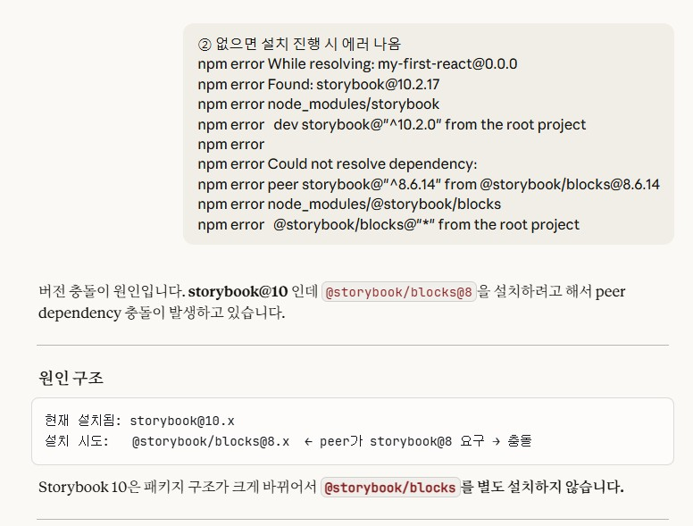
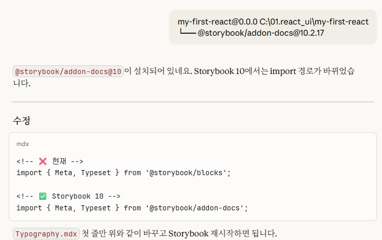
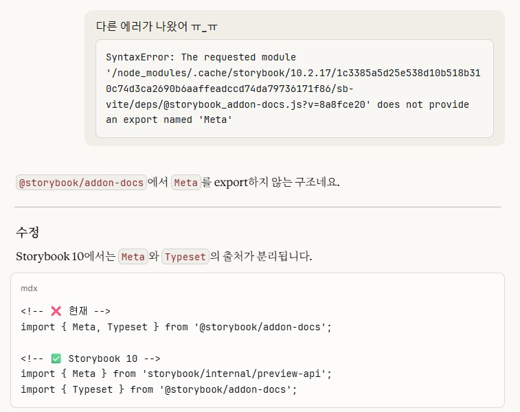
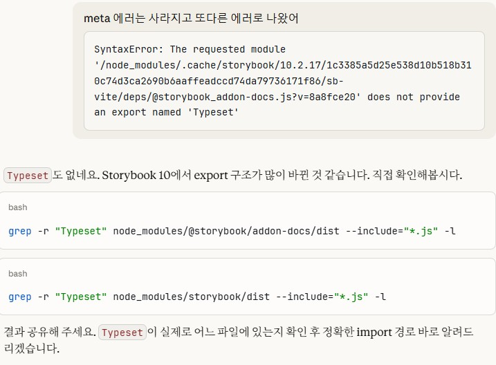
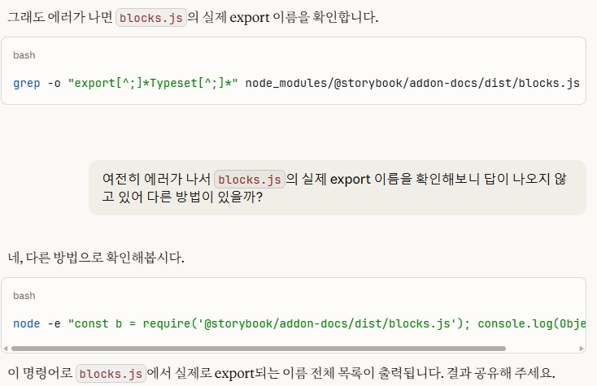
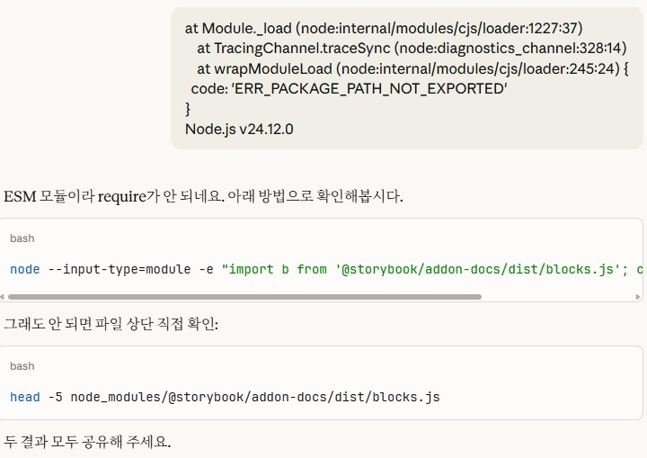

# (2026-03-09) Claude로 Storybook 디자인토큰 적용
 
Storybook에 디자인토큰화 된 부분부터 우선 정리하고 있는데, mdx 파일 만들다가 storybook버전 충돌로  
import 구문하나로 뻘짓을 오전내내 했는데, claude랑 한참 대화하는데, 정말 사수 같았음 
### 정말이지 환장의 콜라보레이션 중이었음 

   
   
   
   
   
  

Gemini는 오히려 Gem에 갇혀 있어서 그런지, 뭔가 다이나믹한 대응보다는 교과서적인 답변이 많아서, 
오히려 코딩할때는 Claude랑 하는게 나은 것 같다.  

실무적으로 보통 사수들을 찾거나 AA 찾아서 해결한 부분들, 프로젝트의 물리적 환경, 배포나 서버에 따른 미묘한 이슈는 
분명 사람이 더 편할 것이다 싶었는데, 
정리정돈이 잘된 프로젝트라면 ai를 이용하는게 더 빠를 것 같음 
ai 역할이 너무 빠르게 커진다. 

