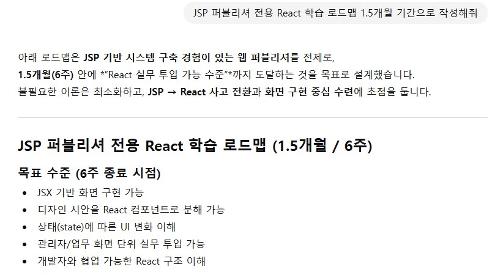

# (2025-12-30) 학습계획을 세워 보자

react를 지금까지 youtube나 책으로만 배우는 것은 너무 더디고,  
실무에 직접 활용을 위해서는 많은 시간이 필요한 것을 깨달았다. 
지금껏, 디자인용 이미지 생성이나 영상 생성을 위한 영문prompt 변환을 위해 사용했던 LLM ai에게 이러한 구체적인 정보를 물어보자. 

  

  
1.5개월은 너무 짧은 것 같으니, 길게 2개월 잡고 시작해 보자.
