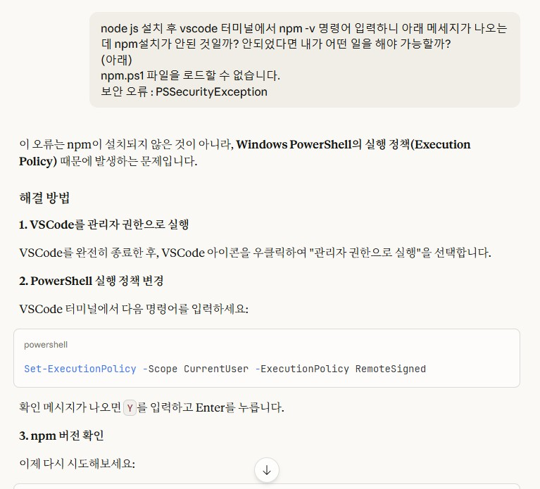
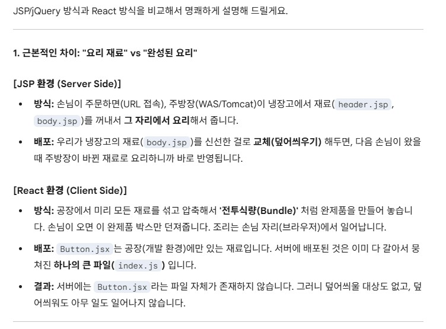

# (2026-01-05) React빌드,배포 개념

Gemini 를 통해 node, npm, git 정의까지 작업하였음. 
일부 터미널 npm 이슈, git 이메일, 이름이 미설정에 따른 이슈가 있어 claude를 통해 질문을 했다. 
claude는 확실히 코드성향이라 그런지 사전설명을 친절하게 하지 않아도 알아듣고 방법을 알려주었다.
 
 

  

  

 
 
기본적인 React 흐름과 jsx에 대한 개념을 인지하고 나니 바로 CSS style과 관련해서 진행하자는 걸  
실무적으로 궁금했던 SPA의 빌드와 배포에 대한 개념을 질문했다. 

질문 promprt

현실적인 질문도 너무 필요한데, 그보다 더 원초적인 질문을 하고 싶어. 
아래 질문에 대해 답을 먼저 해주면 고마울 것 같아. 
현재 주요 컴포넌트가 jsx를 통해 이루어진 것을 이해했어.  
만약 버튼컴포넌트 jsx를 수정하여 개발서버에 반영할 경우 
기존 jsp/jquery 기반에서는 jsp를 수정해서 was서버에 덮어씌워서 배포했어 (별도의 빌드없이) 
react도 그냥 버튼컴포넌트jsx만 web서버에 덮어씌우기로 배포하면 변경되어 실행되는거야?  

  

질문이 너무 기초적이어서 그런지, 바보를 가르치 듯 설명해 준다.

   
  

이해가 한방에 되었는데, 
이말은 내가 영문/한글 혼용하여 실무자 입장에서 쓰는 용어를 Gemini는 모두 이해한다고 느껴졌다. 
무서운 선생님이군. 

