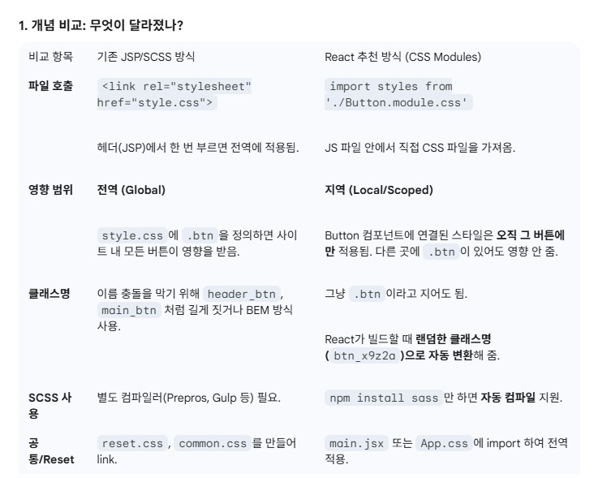
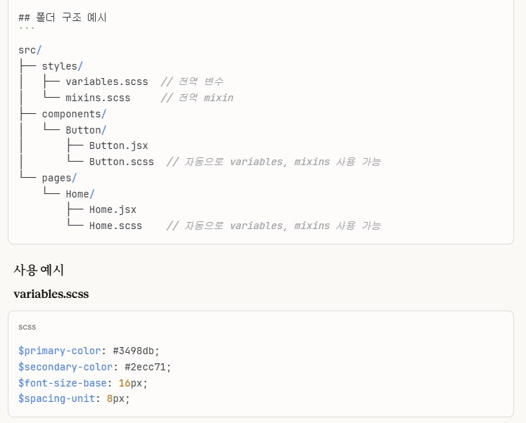
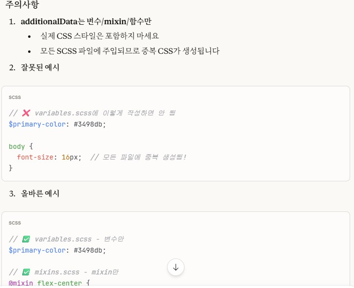

# (2026-01-15) style 입히기 - 기본

가장 기본적인 style을 입히는 작업을 Gemini를 통해 진행함 
고전적인 <header>에 <link> 방식으로 선언하는 것과 비교하여 style 정의 방식을 물었다. 
비교표를 잘 정리해서 답변을 주었다. 
고전적인 방식은 '전역' 형식이라면 react는 '지역, local, scope' 형식으로 작동되는 것을 인지했다. 
 

  

 
또한 빌드 시 각 jsx에 겹쳐지지 않게 css className을 임의로 수정하여 빌드한다는 것도 알았다. 
(이건 빌드모듈에 따라 className이 변동되는 것이려나? > 이런 기술적인 질문은 Claude에게 물어보았다.  
훨씬 이해하기 쉽게 대답해준다.) 
 

  

  
React가 아무리 모듈별 scss를 사용한닥호 하더라도 
빈번하고 반복적인 변수와 mixin은 전역으로 사용해야 한다. 
빌드 시 이 변수와 mixin파일을 항상 선언되도록 vite.config.js를 수정하면서 
Gemini는 약간 디테일이 떨어진것에 반해 Claude는 디테일한 정보가 많았다. 

  

 

  

 

  

  

급박한 마음에 대충 물어도 대답을 해준다. 

  

  

현재 vite를 이용해 빌드를 하면서 궁금한 점이 있을 때 
순차적이고 기초적인 학습질문은 Gemini를 통해 진행하고 
각 순간에 에러 이슈나 디테일한 궁금증은 Claude를 통해 문의하고 있는데, 
효과가 매우 좋다. 

학습의 흐름도 멈추지 않게 되어 좋기도 하고 
Claude의 코딩적 해설이 너무 쉽고, 예시도 이해하기 쉽게 여러가지를 이야기 한다.  

module.scss 와 .scss에 대한 질문도 대답을 통해 전역css와 모듈css 분리해서 작업함을 알게 되었다. 
레거시와의 호환성도 함께 추천해 준다. 점점 Claude도 맘에 든다. (그치만 결제하기엔 내가 너무 가난하다) 

  

  
너무 오랜만에 프로젝트를 열어서 그런지 기존 것들이 가끔 까먹는 경우도 있다. 
매일 하는 수밖에 없다. 
