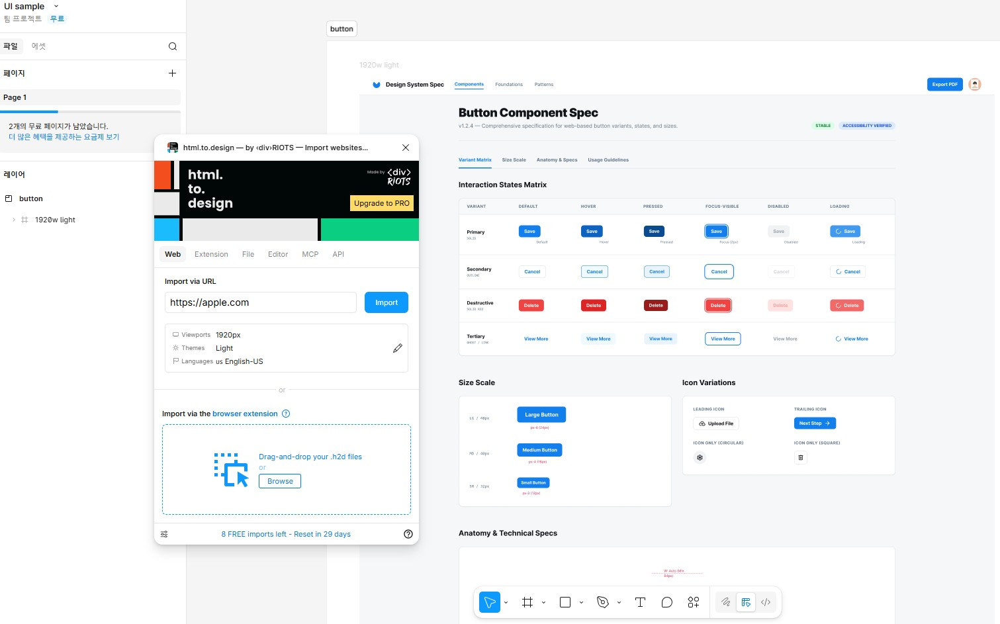
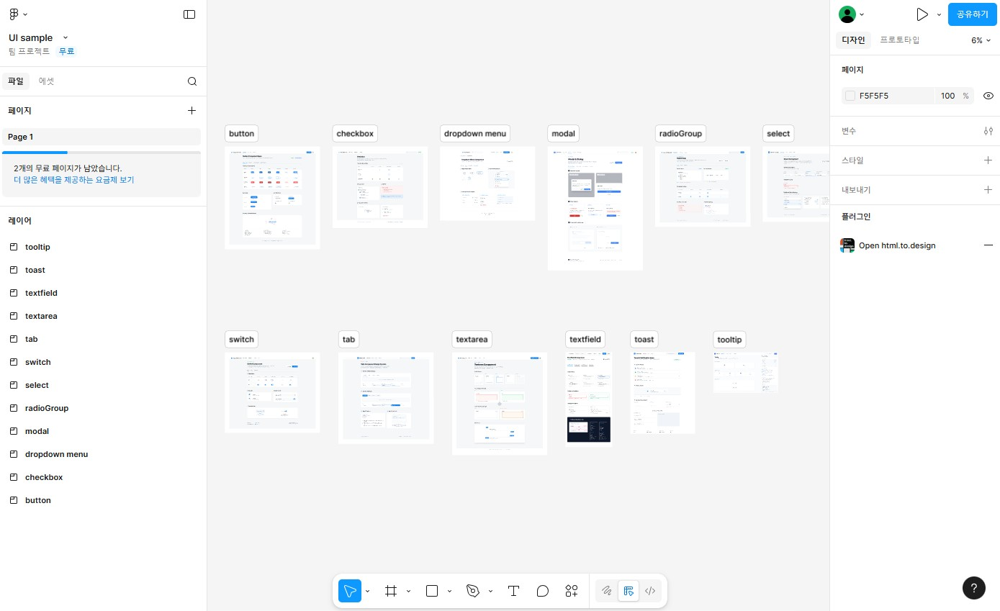

# (2026-01-20) figma생성
 
style 처리 과정까지 한바퀴 돌고나니, 컴포넌트 jsx를 본격적으로 생성에 앞서 
UI 컴포넌트을 상상으로 만들 수는 없으니, AI를 이용해 UI컴포넌트를 생성하기로 했다.  

보통 일관성 있는 이미지를 AI를 통해 생성하는 것이 쉬운 것은 아니다.  
1회성 생성은 나의 의도와 상관없이 진행되고, 수정도 프롬프트를 통해서만 진행되다보니 쉽지 않다. 
(모든 창작물이 한방 딱! 이런 느낌이 아니기에, 결국 수정의 연속인데 이것을 감안한 AI 서비스가 그렇게 많지 않다.)  
거기다 단순한 이미지 생성이 아닌 UI component는 그 디자인 내 함의가 있기에 더 신중해야 한다.   

### 디자인생성용 프롬프트를 생성하자

우선 UI컴포넌트 생성을 위한 Prompt를 ChatGPT를 통해 생성했다. 
웹표준, 웹접근성을 기본적으로 지키고, 각 ui 상태(state)를 담은 요소로 만들고 12개의 특정요소를 지정했다. 

ui 컴포넌트용 예시 디자인을 ai 생성기로 생성하려해 기본적인 웨/앱 UI컴포넌트 12개는 아래와 같고,  
  각 시멘틱웹 및 웹표준, 웹접근성 기준으로 상태값(State)을 포함한 디자인이 필요해  
  -아래- Button, TextField (Input), Textarea, Select, Checkbox, RadioGroup, Switch (Toggle), Modal / Dialog, Tabs, Dropdown / Menu, Toast / Notification, Tooltip  
  위 조건에 충족하는 디자인 AI생성용 프롬프로를 작성해 주고, 설명을 해줘

 
master 답변과 12개 컴포넌트별 생성prompt를 별도로 생성해 주었다. 

<strong>MASTER</strong> 
Create a clean, production-ready UI component design system sheet for web and mobile. Modern neutral UI, 8px spacing grid, subtle elevation, clear focus indicators. Show multiple states for accessibility: default, hover, pressed/active, focus-visible (keyboard), disabled, error, success, loading where applicable. High contrast, readable typography, consistent icon style. Include minimal English labels for states (e.g., Default, Hover, Focus, Disabled, Error) as small captions. Present as a Figma-style component spec board on a light background, with consistent padding and alignment. No mock marketing visuals, no decorative illustrations, no photorealistic scenes.
  
1) Button 
Component: Button. Provide variants: Primary, Secondary, Tertiary/ghost, Destructive. States per variant: default, hover, pressed, focus-visible with strong focus ring, disabled, loading (spinner + label). Show size scale: S/M/L and icon-only button. Include label examples: “Save”, “Cancel”, “Delete”. Ensure hit area looks at least 44x44 on mobile. Provide spacing tokens around icons and text.

 
<a href="https://chatgpt.com/share/696f0c7f-5528-8005-8afe-ac1d581d52d7">https://chatgpt.com/share/696f0c7f-5528-8005-8afe-ac1d581d52d7</a>
  

### Stitich를 통해서 실제 디자인과 html을 만들어 보자
12개를 모두 Stitch 통해 디자인 및 html코드화 시켰다. 
12개를 각각 진행하다보니 시간이 꽤 걸렸다.  
컴포넌트당 약 50초 정도. / 기본 3장  
그나마 google에 흡수되어 beta로 무료니까 마구마구 쓰고 있는데, 언제 갑자기 크레딧 연동될지 모른다.  

  

 
<a href="https://stitch.withgoogle.com/projects/7978047561125982917">https://stitch.withgoogle.com/projects/7978047561125982917</a>
  

### Figma로 실제 디자인파일로 만들어 보자
이렇게 생성된 디자인과 html을 내보내기로 다운로드 한 후 figma에서 디자인으로 푼다. 
figma plugin 중 'stitch to figma' (<a href="https://www.figma.com/community/plugin/1577379704241183556/stitch-to-figma">https://www.figma.com/community/plugin/1577379704241183556/stitch-to-figma</a>)를 먼저 돌려서 html을 upload하여 진행했는데, 아웃풋 desktop, mobile 설정을 조절을 잘 해야 하고 
이왕이면 html code를 입력해 생성할 경우 훨씬 결과가 좋았다. 
플러그인 화면 사이즈에 맞게 생성되기에 desktop 모드일경우 화면 preview 크기를 실제 크기만큼은 늘려줘야 함  
 

  

 
 
다른 플러그인 'html to design' (<a href="https://www.figma.com/community/plugin/1159123024924461424/html-to-design-by-divriots-import-websites-to-figma-designs-web-html-css">
https://www.figma.com/community/plugin/1159123024924461424/html-to-design-by-divriots-import-websites-to-figma-designs-web-html-css
</a>)을 통해서 figma 파일을 생성하기도했다. 
  

  

  
이 플러그인도 30일에 10개 제한 무료라서 이번 컴포넌트 변환으로 모조리 쓰고 말았다. 
죄다 돈이구나.. 
figma는 아직 유로가 아니다. 
 
결과 <a href="https://www.figma.com/design/A9ulLGFxHl55wJkkeEAV4S/UI-sample?node-id=0-1&t=oVUdF45IPEKT30cD-1">https://www.figma.com/design/A9ulLGFxHl55wJkkeEAV4S/UI-sample?node-id=0-1&t=oVUdF45IPEKT30cD-1</a>
 

  

