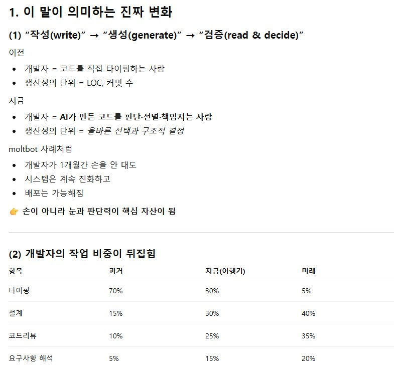
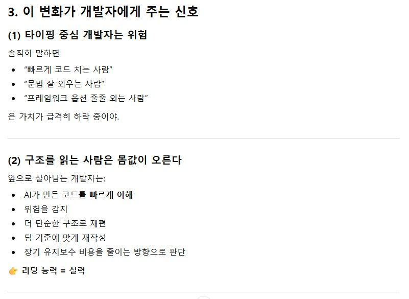

# (2026-01-30) 어디로 가야 하죠 아저씨
 
props가 점점 늘어남에 따라 스프레드 연산자 처리를 알려줘서 테스트 해보았다. 
이렇게 신박할 수가... 점 세 개로 못하는게 없구나.  

여튼,  

계속 보다보니 결국 state는 물론 props의 사전 범위 설계 및 유지관리에 대한 기준서나 메뉴얼이 필요하겠다는 생각이 들었다. 
결국 돌고 돌아, 또 설계다. 
모든 UI작업자들의 기준이 있어야 하고, 그 기준은 요구사항정의를 제대로 분석하고, 방향성을 잡을 줄 알아야 한다. 
그것이 워터폴(Waterfall) 방법론이든 애자일(Agile) 방법론이든, 모든 분석/설계 역량은 꼭 필요하다는 거겠지.  

그나저나, 
MoltBot 개발자가 지난 한달동안 확인하지 않은 코드를 배포했다는데, 즉 ai가 생성한 코드를 눈으로 확인하는 과정 없이 배포되었다는 말인데 
우스개 소리 같은 "코드를 작성하는 시대는 끝났고, 코드를 읽는 시대가 되었다" 라는 말이 우스개로 안끝나는 상황이 되어버렸다. 
이 소식으로 chatGPT의 생각을 물어보니, 개발자 역할이 바뀌는 시대라고 답변 해 준다.  

내용 자체로 보면 당연한 결과인데, 점점 더 빨라져서 무섭군...  

  

  

  

  

  

