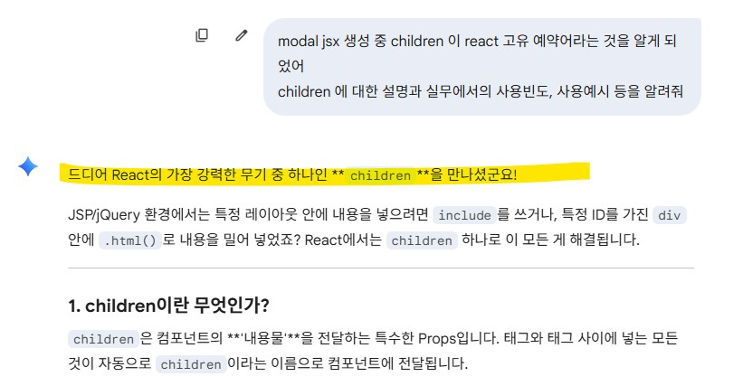

# (2026-02-09) 안물어보면 대답 안함 
 
react의 여러 Hook 중에 하나인 Portal을 통해 modal 컴포넌트 시작한다.  

교육 중 예시로 들어준 소스를 보니 책이나 온라인과 다른 지점이 보인다. 
분명 지금까지의 과정중에 하나도 나오지 않은 구문이나, 예약어를 진행하거나, 
storybook jsx작성 중에도 템플릿 방식도 다르게 하는 지점이 나오기 시작한다.  

아무래도 1개 채팅에 대화를 15건 이상 지나서 그런 듯, 시간이 지날 수록 조금씩 헷갈려 한다. 
많은 양의 토큰 문제인지는 정확히 알 수 없지만, 어째든  
사전 설명도 없던 childern 예약어를 시전하길래, 하나씩 되물어보니, 
다시 친절하게 설명해준다.  

  

  어머 선생님, 선생님이 그렇게 말씀하심 안되죠... 선생님이 먼저 쓰셔놓고 모른척 하심 안되죠;;;

 

### ai는 언제나 내가 궁금하다고 구체적으로 물어보지 않는 한, 내가 이것을 모를지 아는지 모른다. 
이상하다 싶으면 잽싸게 또 물어보고, 저건 왜 저러냐? 이건 왜 아까 규칙이랑 다르냐 라고 자꾸 물어봐야 대답해 준다.  

그 와중에 claude 무료로 토큰이 벌써 끝나서, (심지어 나 대화만 한다고, voscode로 소스 연결도 안한다고;;;) 
어쩔 수 없이 월결제 해버림. 
