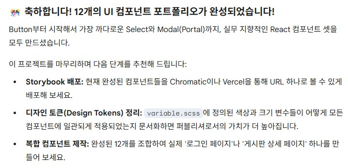

# (2026-03-01) UI Component 완료!
 
별도의 기록일지 없이 나머지 component 진행하여 달리기. 
업무하듯매번 하나하나에서 이해될 때까지 멈추는 경향이 커서, 진행속도가 안나와서 
나머지 5개 컴포넌트는 맥락만 이해되면 완료하는 방식으로 먼저 진행 후,  
지속적인 리팩토링을 하면서 이해도를 높이는 방식으로 진행했다. 

  

 
확실히 이 편이 속도는 빠르고, 실무스러운 기반이 보였다. 
무엇보다 prop type을 일괄적으로 리팩토링화 하면서 실무 커뮤니케이션 이슈가 꽤 있어 보였다.  

레거시에서 그나마 구분된 영역이 React 프로젝트에서는 굳이, 구분될 필요가 없다보니 더 이슈가 생길 것으로 보여진다. 
(프로젝트에 따라 역할 구분을 잘 해야될 것으로 보인다.)  

### 남은 것은 아래 3가지 
1) 실무적 페이지 구현 : 작성 UI Component를 활용하여 특정 Grid페이지 구현 (Grid Component 추가 필요) 
2) UI Component 확인용 Storybook 포트폴리오 url 연결 
3) UI 최종 프로젝트용 포트폴리오 url 연결  

### 추가적인 리팩토링 
1) UI 디자인style 토큰화 처리를 위한 scss 리팩토링 후 업데이트 
2) 디자인style 토큰화 Storybook 연결  

3월 내에는 완료 될 듯 하다. 

